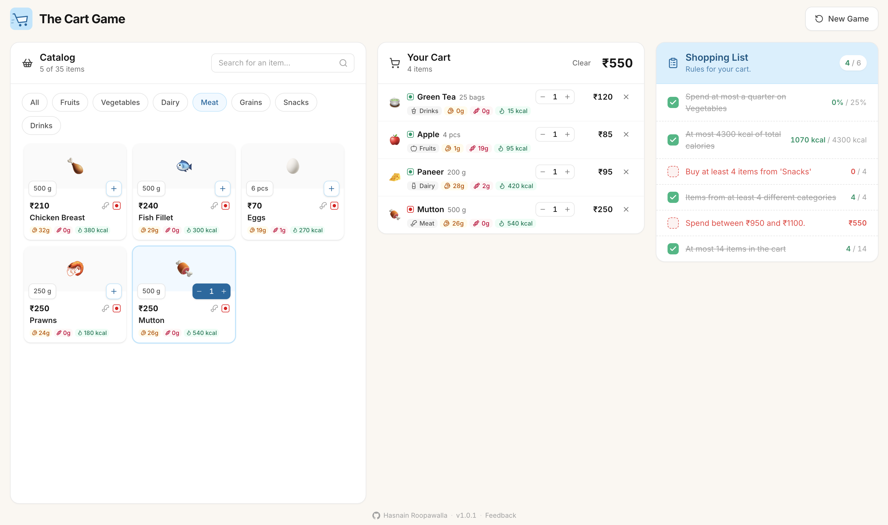

# 🛒 The Cart Game

**Grocery puzzle game — build a cart that satisfies a list of competing rules.**

The shopping list isn't a list of items — it's a list of _constraints_. Hit at least 70g of protein, spend between ₹300 and ₹400, keep half the cart vegetarian, stay under 8 items. Each rule is trivial alone. Together, they fight.

**[▶ Play it](https://hasnainroopawalla.github.io/the-cart-game)**



## How to play

Every game opens with the full shopping list of rules and a catalog of grocery items across several categories.

1. Read the rules and work out which items could serve more than one of them.
2. Add items to your cart. Every rule re-evaluates on every change.
3. Satisfy all of them at the same time to win.

Every board is generated from a hidden solution cart, so **at least one valid answer always exists** — you're never handed an impossible puzzle. Finding _a_ solution is the game; finding it in few moves is the skill.

## Development

```bash
yarn install
yarn dev        # localhost:5173

yarn test       # unit tests

yarn lint
yarn build
```

## License

MIT © [Hasnain Roopawalla](https://github.com/hasnainroopawalla)
